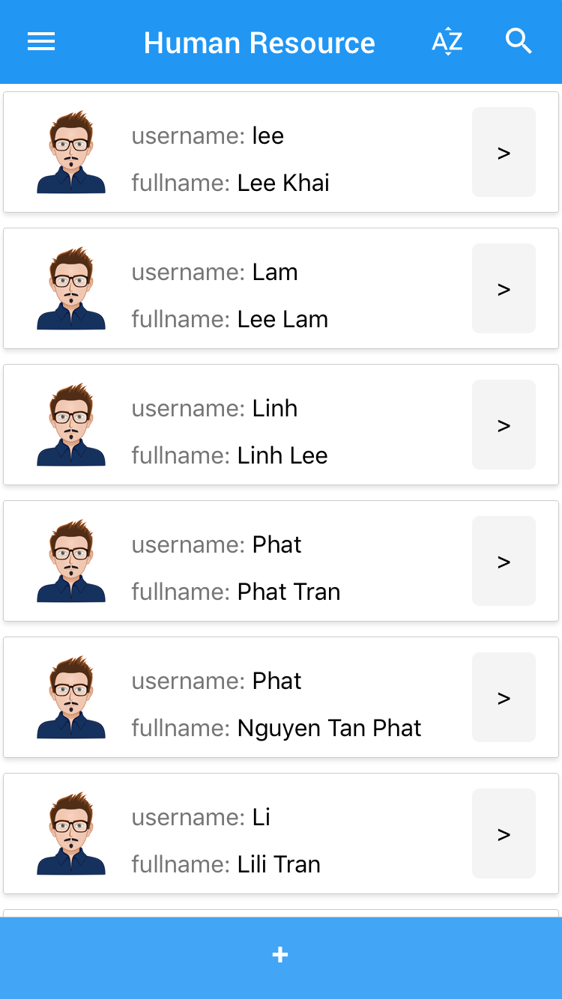
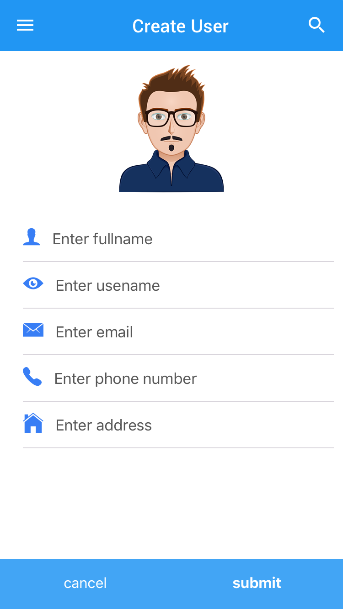
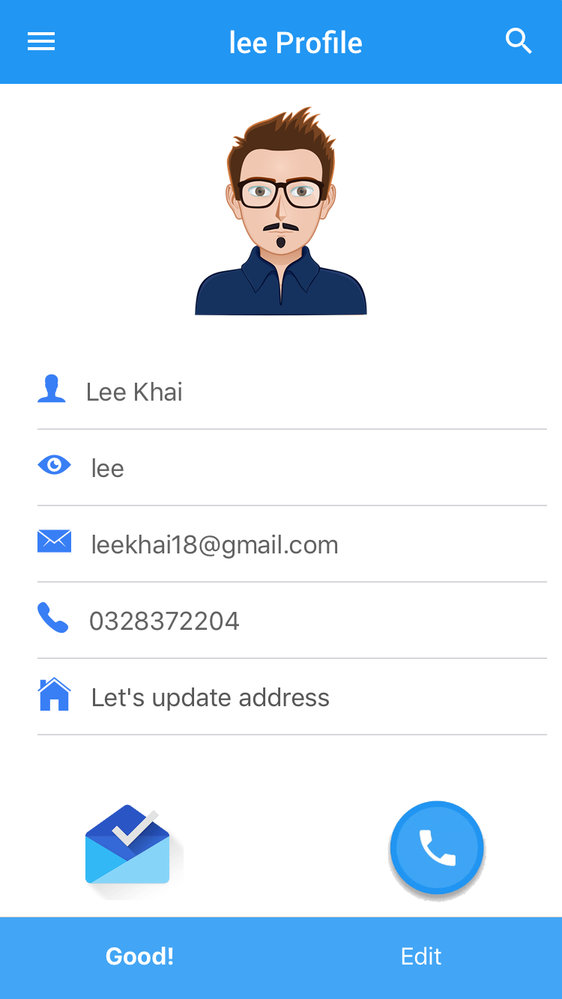

# park-eco-mobile-manager 💼
A mobile management application for managers of ParkEco system. Take control of the parking lots in your system everywhere you go.

<p align="center">
     
</p>

# Usage 

With ParkEco Mobile Manager, you can:
- Create and manage parking lots in a system. See live updates on a real map.
<p align="center">
    
</p>

- Create and manage parking lot attendants.
<p align="center">
     
</p>


- Connect and manage different systems.


- View and export helpful reports and insights.
<p align="center">
   
</p>


# Build from source

Clone this repository to your machine.
```
git clone https://github.com/park-eco/park-eco-mobile-manager.git
```

Make sure you have npm (or yarn) and [react-native-cli](https://www.npmjs.com/package/react-native-cli) installed globally. 

First, restore the packages.
```
npm install 
// or using "yarn install"
``` 

If using Windows, you may want to connect to a physical device or run an emulator first, then run:
```
react-native run-android
```

Alternatively, for iOS:
```
react-native run-ios
```

# Technology Stack 📚
- [ReactNative](https://github.com/facebook/react-native) as a powerful cross-platform framework.
- [NativeBase](https://github.com/GeekyAnts/NativeBase), a beautiful UI library for ReactNative applications.
- And many more awesome open-source components such as [react-native-maps](https://github.com/react-native-community/react-native-maps), [react-native-phone-call](https://github.com/tiaanduplessis/react-native-phone-call), [react-navigation](https://github.com/react-navigation/react-navigation), etc.

# Contributing
Please read CONTRIBUTING.md for details on our code of conduct, and the process for submitting pull requests to us.

# Authors
Lam Le, Khai Le, Linh Le, and Phat Nguyen.
See also the list of contributors who participated in this project.

# License
This project is licensed under the MIT License - see the [LICENSE.md](LICENSE) file for details
